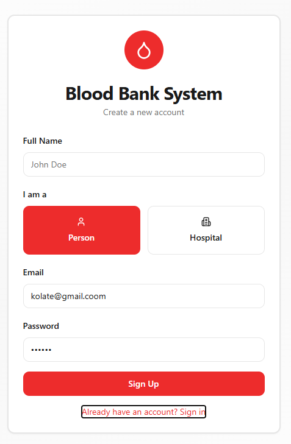
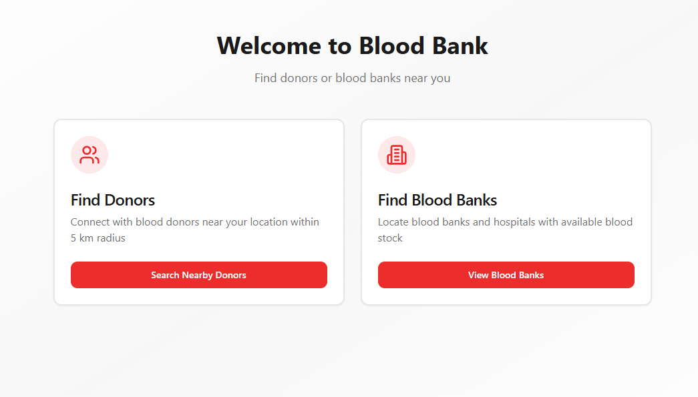
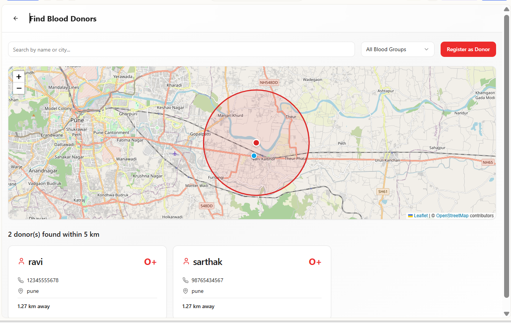
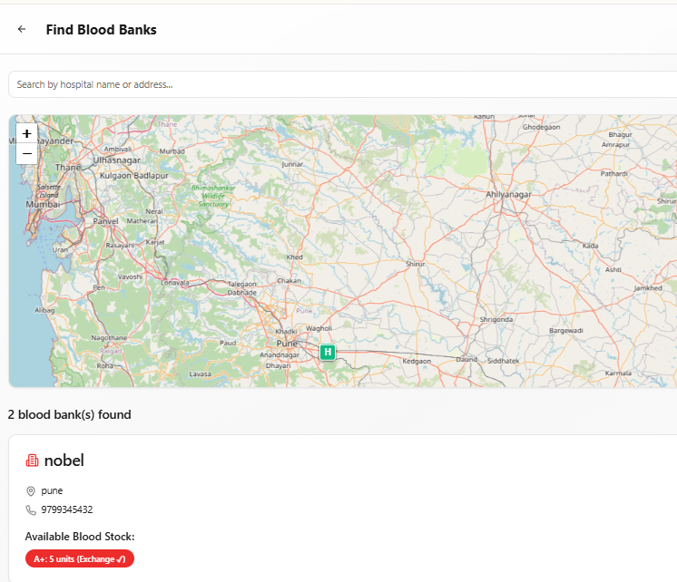
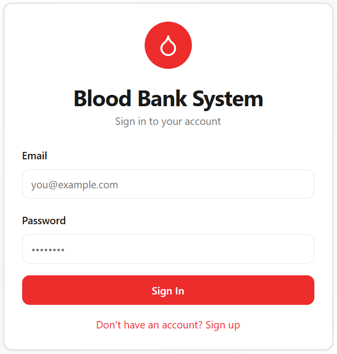

# Blood Bank Management System

A web-based Blood Bank Management System developed using React, TypeScript, Tailwind CSS, and Supabase.

## Features

- Donor Registration
- Blood Availability Tracking
- Blood Request Management
- Admin Dashboard
- Authentication System

## Tech Stack

- React
- TypeScript
- Tailwind CSS
- Supabase
- Vite

## Installation

```bash
npm install
npm run dev
```

## Project Screenshots










## Author

Jayesh Bhosale